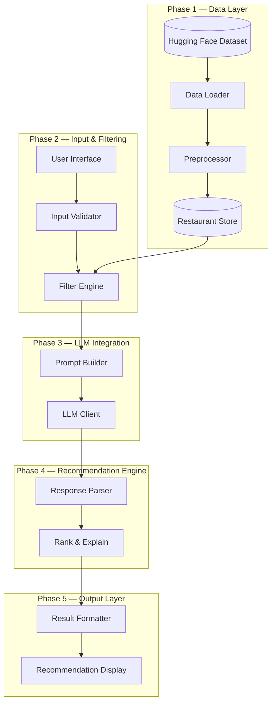
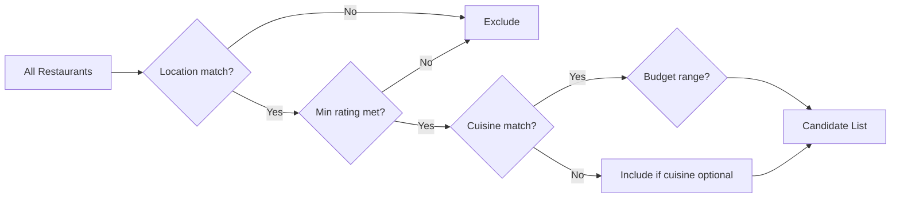
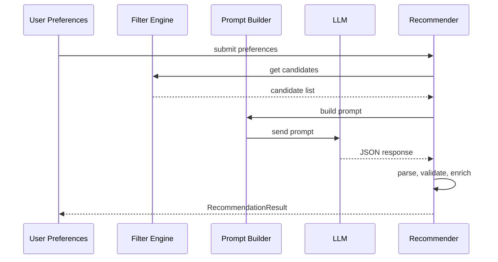
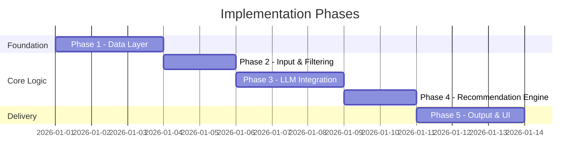

# Phase-Wise Architecture: AI-Powered Restaurant Recommendation System

This document describes the system architecture in implementation phases, aligned with the [problem statement](./problemStatement.md).

---

## High-Level Architecture



---

## Architecture Principles

| Principle | Description |
|-----------|-------------|
| **Separation of concerns** | Data, filtering, LLM logic, and UI live in distinct modules |
| **Dataset as source of truth** | The LLM reasons over filtered real data — it does not invent restaurants |
| **Progressive delivery** | Each phase produces a testable, runnable increment |
| **Prompt as integration contract** | Structured JSON in, structured recommendations out |

---

## Phase Overview

| Phase | Name | Goal | Depends On |
|-------|------|------|------------|
| 1 | Data Layer | Load, clean, and serve restaurant data | — |
| 2 | Input & Filtering | Accept preferences and narrow candidates | Phase 1 |
| 3 | LLM Integration | Connect to an LLM with a well-designed prompt | Phase 2 |
| 4 | Recommendation Engine | Parse, rank, and explain results | Phase 3 |
| 5 | Output & UI | Present recommendations to the user | Phase 4 |

---

## Phase 1: Data Layer

**Goal:** Ingest the Zomato dataset and expose clean, queryable restaurant records.

### Components

```
data/
├── loader.py          # Fetch dataset from Hugging Face
├── preprocessor.py    # Clean, normalize, and map fields
├── models.py          # Restaurant schema / dataclass
└── repository.py      # In-memory or cached data access
```

### Responsibilities

- Download the dataset from [ManikaSaini/zomato-restaurant-recommendation](https://huggingface.co/datasets/ManikaSaini/zomato-restaurant-recommendation)
- Extract fields: name, location, cuisine, cost, rating, and any useful metadata
- Normalize values (e.g., unify location names, parse cost ranges, handle missing ratings)
- Expose a `RestaurantRepository` with methods like `get_all()` and `filter_by(criteria)`

### Data Model (example)

```python
Restaurant:
  - id: str
  - name: str
  - location: str
  - cuisines: list[str]
  - cost_for_two: int | str
  - rating: float
  - votes: int (optional)
  - rest_type: str (optional)
```

### Deliverables

- [ ] Dataset loads successfully on startup
- [ ] Preprocessed records pass validation (no critical nulls)
- [ ] Repository returns filtered subsets by location, cuisine, rating, budget

### Exit Criteria

Running a script or test that loads data and filters restaurants by location returns a non-empty, correctly shaped list.

---

## Phase 2: Input & Filtering

**Goal:** Collect user preferences and reduce the full dataset to a relevant candidate set before LLM processing.

### Components

```
input/
├── schemas.py         # UserPreference model (Pydantic / dataclass)
├── validator.py       # Input validation and defaults
└── filter_engine.py   # Rule-based candidate filtering
```

### User Preference Schema

| Field | Type | Required | Notes |
|-------|------|----------|-------|
| `location` | string | Yes | e.g., "Bangalore" |
| `budget` | enum | Yes | `low` \| `medium` \| `high` |
| `cuisine` | string | No | Partial match allowed |
| `min_rating` | float | No | Default: 0.0 |
| `extra_preferences` | string | No | Free-text (family-friendly, etc.) |

### Filter Engine Logic



1. Filter by **location** (exact or fuzzy match)
2. Filter by **minimum rating**
3. Filter by **cuisine** (if provided)
4. Filter by **budget tier** (map cost ranges to low/medium/high)
5. Cap candidates (e.g., top 20–30 by rating) to keep LLM context manageable

### Deliverables

- [ ] Validated user preference object
- [ ] Filter engine returns ranked candidate list
- [ ] Empty-result handling with a clear message

### Exit Criteria

Given sample preferences, the filter engine returns a bounded, relevant candidate set without calling the LLM.

---

## Phase 3: LLM Integration

**Goal:** Build the bridge between structured restaurant data and the LLM.

### Components

```
llm/
├── prompt_templates.py   # System + user prompt templates
├── prompt_builder.py     # Inject preferences + candidates into prompt
├── client.py             # LLM API wrapper (Groq via OpenAI-compatible API)
└── config.py             # Model name, API key, temperature
```

### Prompt Design

**System prompt** — define the assistant role:

> You are a restaurant recommendation expert. Given user preferences and a list of real restaurants, rank the best options and explain why each fits. Only recommend restaurants from the provided list.

**User prompt** — structured input:

```
User Preferences:
- Location: Bangalore
- Budget: medium
- Cuisine: Italian
- Min Rating: 4.0
- Extra: family-friendly

Candidate Restaurants:
[{ "name": "...", "cuisine": "...", "rating": 4.5, "cost": "..." }, ...]

Return JSON:
{
  "recommendations": [
    { "name": "...", "rank": 1, "explanation": "..." }
  ],
  "summary": "..."
}
```

### Deliverables

- [ ] Configurable LLM client with error handling and retries
- [ ] Prompt builder that serializes preferences + candidates
- [ ] Structured JSON response format defined and documented

### Exit Criteria

A standalone script sends a prompt with sample data and receives a parseable JSON response from the LLM.

---

## Phase 4: Recommendation Engine

**Goal:** Turn raw LLM output into validated, ranked recommendations tied back to dataset records.

### Components

```
engine/
├── parser.py          # Parse and validate LLM JSON response
├── ranker.py          # Merge LLM ranking with source data
└── recommender.py     # Orchestrator: filter → prompt → parse → rank
```

### Processing Flow



### Responsibilities

- Parse LLM JSON; handle malformed responses gracefully
- Cross-reference LLM picks against the candidate list (prevent hallucinated restaurants)
- Enrich each recommendation with full fields: cuisine, rating, cost
- Attach AI-generated explanation and optional summary
- Return top N recommendations (e.g., 3–5)

### Output Schema

```python
Recommendation:
  - rank: int
  - name: str
  - cuisine: str
  - rating: float
  - estimated_cost: str
  - explanation: str

RecommendationResult:
  - recommendations: list[Recommendation]
  - summary: str | None
```

### Deliverables

- [ ] End-to-end recommender service (preferences in → results out)
- [ ] Hallucination guard (only dataset-backed restaurants)
- [ ] Fallback when LLM fails (e.g., return top-rated filtered results)

### Exit Criteria

Calling `recommender.recommend(preferences)` returns a complete, validated `RecommendationResult`.

---

## Phase 5: Output & User Interface

**Goal:** Expose the recommendation flow through a clear, user-friendly interface.

### Components

```
app/
├── main.py            # Entry point (CLI or web app)
├── ui/
│   ├── forms.py       # Preference input form
│   └── results.py     # Recommendation cards / table
└── api/               # Optional REST layer
    └── routes.py
```

### UI Options

| Option | Best For | Stack Example |
|--------|----------|---------------|
| **CLI** | Quick MVP, testing | Python `argparse` / `typer` |
| **Web UI** | Demo, usability | Streamlit or Gradio |
| **API + Frontend** | Production-style | FastAPI + React |

### Display Format (per recommendation)

```
┌─────────────────────────────────────────┐
│ #1  Truffles                            │
│ Italian · ★ 4.6 · ₹1,500 for two       │
│                                         │
│ Great fit for medium budget Italian     │
│ dining in Bangalore with family-friendly│
│ ambiance and consistently high ratings. │
└─────────────────────────────────────────┘
```

### Deliverables

- [ ] Preference input form with validation feedback
- [ ] Loading state while LLM processes
- [ ] Recommendation cards with all required fields
- [ ] Empty-state and error-state messaging

### Exit Criteria

A user can enter preferences, submit, and see ranked recommendations with explanations — without touching internal modules directly.

---

## End-to-End Data Flow

```
User Preferences
      │
      ▼
┌─────────────┐     ┌──────────────┐     ┌─────────────┐
│  Validator  │────▶│ Filter Engine│────▶│Prompt Builder│
└─────────────┘     └──────────────┘     └──────┬──────┘
                                                │
                                                ▼
                                         ┌─────────────┐
                                         │  LLM Client │
                                         └──────┬──────┘
                                                │
                                                ▼
                                         ┌─────────────┐
                                         │   Parser    │
                                         └──────┬──────┘
                                                │
                                                ▼
                                         ┌─────────────┐
                                         │  Formatter  │────▶ User
                                         └─────────────┘
```

---

## Suggested Project Structure

```
MileStone1/
├── docs/
│   ├── problemStatement.md
│   └── architecture.md
├── src/
│   ├── data/           # Phase 1
│   ├── input/          # Phase 2
│   ├── llm/            # Phase 3
│   ├── engine/         # Phase 4
│   └── app/            # Phase 5
├── tests/
│   ├── test_data.py
│   ├── test_filter.py
│   ├── test_llm.py
│   └── test_recommender.py
├── requirements.txt
└── README.md
```

---

## Phase Dependencies & Timeline



| Phase | Estimated Effort | Blockers |
|-------|------------------|----------|
| 1 — Data Layer | 2–3 days | Hugging Face access, dataset schema review |
| 2 — Input & Filtering | 1–2 days | Budget-to-cost mapping rules |
| 3 — LLM Integration | 2–3 days | API key, model selection, prompt tuning |
| 4 — Recommendation Engine | 1–2 days | LLM response reliability |
| 5 — Output & UI | 2–3 days | UI framework choice |

---

## Risks & Mitigations

| Risk | Impact | Mitigation |
|------|--------|------------|
| LLM hallucinates restaurants | Wrong recommendations | Constrain prompt; validate names against candidate list |
| Large candidate lists exceed context | Truncated or failed prompts | Pre-filter and cap at 20–30 restaurants |
| Inconsistent LLM JSON | Parse failures | Use JSON mode / structured output; add retry with stricter prompt |
| Missing or dirty dataset fields | Poor filter results | Preprocessor defaults; skip records with critical nulls |
| API latency | Slow UX | Show loading state; cache dataset in memory |

---

## Success Metrics

| Metric | Target |
|--------|--------|
| Data load time | < 10 seconds on first run |
| Filter response time | < 500 ms |
| End-to-end recommendation time | < 15 seconds (LLM-dependent) |
| Recommendation accuracy | All returned restaurants exist in the dataset |
| User-facing fields | Name, cuisine, rating, cost, explanation present for each result |

---

## Next Steps

1. **Phase 1** — Set up project skeleton, install dependencies, load and inspect the dataset
2. **Phase 2** — Implement `UserPreference` schema and filter engine with unit tests
3. **Phase 3** — Integrate LLM client and iterate on prompt template
4. **Phase 4** — Wire recommender orchestrator with hallucination guards
5. **Phase 5** — Build UI and run end-to-end demo
