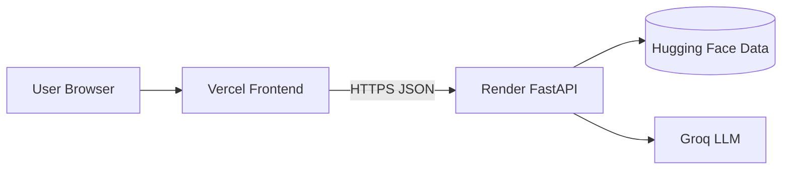

# Phase 6 — Deployment (Vercel + Render)

Deploy the React UI to **Vercel** and the FastAPI backend to **Render**.



## Prerequisites

- Code on GitHub: [MikeAlpha0612/Dine.AI](https://github.com/MikeAlpha0612/Dine.AI)
- [Vercel](https://vercel.com) account connected to GitHub
- [Render](https://render.com) account connected to GitHub
- Groq API key from [console.groq.com/keys](https://console.groq.com/keys)

## 1. Deploy backend on Render

### Option A — Blueprint (`render.yaml`)

1. In Render: **New → Blueprint**
2. Select the `Dine.AI` repository
3. Apply `render.yaml` (creates `dine-ai-api`)
4. Set secret env vars in the Render dashboard:

| Variable | Value |
|----------|--------|
| `GROQ_API_KEY` | Your Groq key |
| `CORS_ORIGINS` | Your Vercel URL, e.g. `https://dine-ai.vercel.app` (comma-separated if multiple) |

`APP_MAX_ROWS=20000` is already set for free-tier memory/boot time.

### Option B — Manual web service

| Setting | Value |
|---------|--------|
| Runtime | Python 3 |
| Build command | `pip install -r requirements-prod.txt` |
| Start command | `uvicorn src.phase5_app.api.routes:app --host 0.0.0.0 --port $PORT` |
| Health check | `/health` |

Also set `PYTHONPATH=.`

### Verify

Open `https://<your-service>.onrender.com/health` — expect `"status":"ok"` after the first data load (may take a few minutes on cold start).

> Free Render services spin down when idle. The first request after idle can take 30–60+ seconds while the instance and dataset reload.

## 2. Deploy frontend on Vercel

> **Important:** Do **not** let Vercel treat this repo as a FastAPI project.
> The backend belongs on Render. Only the React app goes on Vercel.

1. In Vercel: **Add New → Project** → import your GitHub repo
2. Under **Root Directory**, click **Edit** and set it to `frontend` (this is the critical step)
3. Framework Preset should become **Vite**. Confirm:

| Setting | Value |
|---------|--------|
| Root Directory | `frontend` |
| Framework Preset | Vite (not FastAPI / Other) |
| Build Command | `npm run build` |
| Output Directory | `dist` |

4. Environment variable:

| Name | Value |
|------|--------|
| `VITE_API_BASE` | `https://<your-service>.onrender.com` (no trailing slash) |

5. Deploy. SPA routes are handled by `frontend/vercel.json`.

If you leave Root Directory as `.` (repo root), the root `vercel.json` still builds `frontend/` as Vite — but setting Root Directory to `frontend` is preferred.

### Fix: “No FastAPI entrypoint found…”

That error means Vercel auto-detected Python/FastAPI instead of Vite. Fix it:

1. Project Settings → **General** → **Root Directory** → `frontend`
2. Project Settings → **General** → Framework → **Vite**
3. Redeploy

Do **not** add `[tool.vercel] entrypoint = ...` in `pyproject.toml` unless you intentionally host the API on Vercel (we use Render for the API).

### Verify

Open the Vercel URL, pick a city, and run **Get AI Recommendations**. Network calls should hit your Render API.

## 3. Wire CORS (after both URLs exist)

1. Copy the Vercel URL (e.g. `https://dine-ai.vercel.app`)
2. On Render, set `CORS_ORIGINS` to that URL
3. Redeploy / restart the Render service if needed

Local defaults still allow `*` when `CORS_ORIGINS` is unset.

## 4. Local production-like check

```bash
# Backend
set PYTHONPATH=.
set CORS_ORIGINS=http://localhost:5173
uvicorn src.phase5_app.api.routes:app --host 127.0.0.1 --port 8000

# Frontend
cd frontend
set VITE_API_BASE=http://127.0.0.1:8000
npm run dev
```

## Config files

| File | Purpose |
|------|---------|
| `render.yaml` | Render Blueprint for the API |
| `requirements-prod.txt` | Slim backend deps for Render |
| `frontend/vercel.json` | Vercel build + SPA rewrite |
| `frontend/.env.example` | Documents `VITE_API_BASE` |
